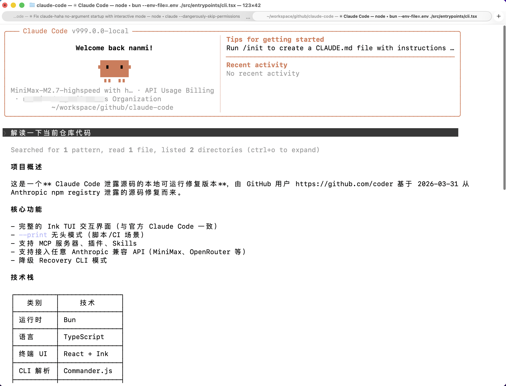

# My Claude Code

> This project is a fork of [Claude Code Haha](https://github.com/NanmiCoder/claude-code-haha). It is for personal local learning and has no plans to merge back into the original repository.

> The fork only tweaks a few configurations and scripts to run on Windows. The following are the original project description.

Based on the leaked source of Claude Code, this is a **local runnable version** that supports any Anthropic-compatible API (e.g., MiniMax, OpenRouter, etc.).

> The original leaked source cannot run directly. This repository fixes multiple blocking issues in the startup chain so that the full Ink TUI interactive interface works locally.

<p align="center">
  
</p>

## Features

- Full Ink TUI interactive interface (same as the official Claude Code)
- `--print` headless mode (scripts/CI scenarios)
- Support MCP servers, plugins, Skills
- Support custom API endpoints and models
- Downgrade Recovery CLI mode

---

## Architecture Overview

<table>
  <tr>
    <td align="center" width="25%"><br><b>Overall Architecture</b></td>
    <td align="center" width="25%"><br><b>Request Lifecycle</b></td>
    <td align="center" width="25%"><br><b>Tool System</b></td>
    <td align="center" width="25%"><br><b>Multi-Agent Architecture</b></td>
  </tr>
  <tr>
    <td align="center" width="25%"><br><b>Terminal UI</b></td>
    <td align="center" width="25%"><br><b>Permissions & Security</b></td>
    <td align="center" width="25%"><br><b>Services Layer</b></td>
    <td align="center" width="25%"><br><b>State & Data Flow</b></td>
  </tr>
</table>

---

## Quick Start

### 1. Install Bun

The project requires [Bun](https://bun.sh). If you don't have Bun installed, run one of the following commands:

```bash
# macOS / Linux (official installer script)
curl -fsSL https://bun.sh/install | bash
```

If you see `unzip is required to install bun` in a minimal Linux environment, install `unzip` first:

```bash
# Ubuntu / Debian
apt update && apt install -y unzip
```

```bash
# macOS (Homebrew)
brew install bun
```

```powershell
# Windows (PowerShell)
powershell -c "irm bun.sh/install.ps1 | iex"
```

After installation, reopen the terminal and confirm:

```bash
bun --version
```

### 2. Install project dependencies

```bash
bun install
```

### 3. Configure environment variables

Copy the example file and fill in your API key:

```bash
cp .env.example .env
```

Edit `.env`:

```env
# API authentication (choose one)
ANTHROPIC_API_KEY=sk-xxx          # Standard API Key (x-api-key header)
ANTHROPIC_AUTH_TOKEN=sk-xxx       # Bearer Token (Authorization header)

# API endpoint (optional, defaults to Anthropic official)
ANTHROPIC_BASE_URL=https://api.minimaxi.com/anthropic

# Model configuration
ANTHROPIC_MODEL=MiniMax-M2.7-highspeed
ANTHROPIC_DEFAULT_SONNET_MODEL=MiniMax-M2.7-highspeed
ANTHROPIC_DEFAULT_HAIKU_MODEL=MiniMax-M2.7-highspeed
ANTHROPIC_DEFAULT_OPUS_MODEL=MiniMax-M2.7-highspeed

# Timeout (ms)
API_TIMEOUT_MS=3000000

# Disable telemetry and non-essential network requests
DISABLE_TELEMETRY=1
CLAUDE_CODE_DISABLE_NONESSENTIAL_TRAFFIC=1
```

### 4. Run

```bash
# Interactive TUI mode (full interface)
./bin/cc.cmd

# Headless mode (single Q&A)
./bin/cc.cmd -p "your prompt here"

# Pipeline input

echo "explain this code" | ./bin/cc.cmd -p

# View all options
./bin/cc.cmd --help
```

---

## Environment Variable Description

| Variable | Required | Description |
|----------|----------|-------------|
| `ANTHROPIC_API_KEY` | One of the two | API Key, sent via `x-api-key` header |
| `ANTHROPIC_AUTH_TOKEN` | One of the two | Auth Token, sent via `Authorization: Bearer` header |
| `ANTHROPIC_BASE_URL` | Optional | Custom API endpoint, default is Anthropic official |
| `ANTHROPIC_MODEL` | Optional | Default model |
| `ANTHROPIC_DEFAULT_SONNET_MODEL` | Optional | Sonnet level model mapping |
| `ANTHROPIC_DEFAULT_HAIKU_MODEL` | Optional | Haiku level model mapping |
| `ANTHROPIC_DEFAULT_OPUS_MODEL` | Optional | Opus level model mapping |
| `API_TIMEOUT_MS` | Optional | API request timeout, default 600000 (10min) |
| `DISABLE_TELEMETRY` | Optional | Set to `1` to disable telemetry |
| `CLAUDE_CODE_DISABLE_NONESSENTIAL_TRAFFIC` | Optional | Set to `1` to disable non-essential network traffic |

---

## Downgrade Mode

If the full TUI fails, use the simplified readline interactive mode:

```bash
CLAUDE_CODE_FORCE_RECOVERY_CLI=1 ./bin/claude-haha
```

---

## Fixes Compared to the Original Leaked Source

The leaked source could not run directly. Major fixes include:

| Issue | Root Cause | Fix |
|-------|------------|-----|
| TUI does not start | The entry script routed to the recovery CLI when started without parameters | Restored full `cli.tsx` entry point |
| Startup deadlock | Missing `.md` files for `verify` skill caused Bun text loader to hang | Created stub `.md` files |
| `--print` deadlock | Missing `filePersistence/types.ts` | Created type stub file |
| `--print` deadlock | Missing `ultraplan/prompt.txt` | Created resource stub file |
| Enter key unresponsive | `modifiers-napi` native package missing, `isModifierPressed()` threw an exception, breaking `handleEnter` and preventing `onSubmit` | Wrapped in try‑catch for resilience |
| Setup skipped | `preload.ts` automatically set `LOCAL_RECOVERY=1`, skipping all initialization | Removed default setting |

---

## Project Structure

```
bin/claude-haha          # Entry script
preload.ts               # Bun preload (sets MACRO global variables)
.env.example             # Environment variable template
src/
├── entrypoints/cli.tsx  # CLI main entry
├── main.tsx             # TUI main logic (Commander.js + React/Ink)
├── localRecoveryCli.ts  # Downgrade Recovery CLI
├── setup.ts             # Startup initialization
├── screens/REPL.tsx     # Interactive REPL screen
├── ink/                 # Ink terminal rendering engine
├── components/          # UI components
├── tools/               # Agent tools (Bash, Edit, Grep, etc.)
├── commands/            # Slash commands (/commit, /review, etc.)
├── skills/              # Skill system
├── services/            # Service layer (API, MCP, OAuth, etc.)
├── hooks/               # React hooks
└── utils/               # Utility functions
```

---

## Tech Stack

| Category | Technology |
|----------|------------|
| Runtime | [Bun](https://bun.sh) |
| Language | TypeScript |
| Terminal UI | React + [Ink](https://github.com/vadimdemedes/ink) |
| CLI parsing | Commander.js |
| API | Anthropic SDK |
| Protocol | MCP, LSP |

---

## Disclaimer

This repository is based on the 2026-03-31 leaked Anthropic npm registry source of Claude Code. All original source code copyright belongs to [Anthropic](https://www.anthropic.com). It is for learning and research purposes only.
